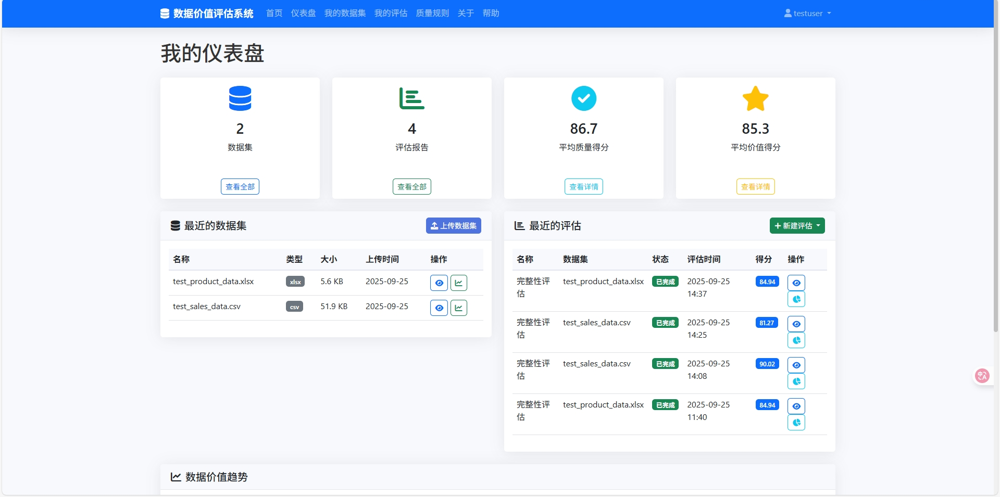
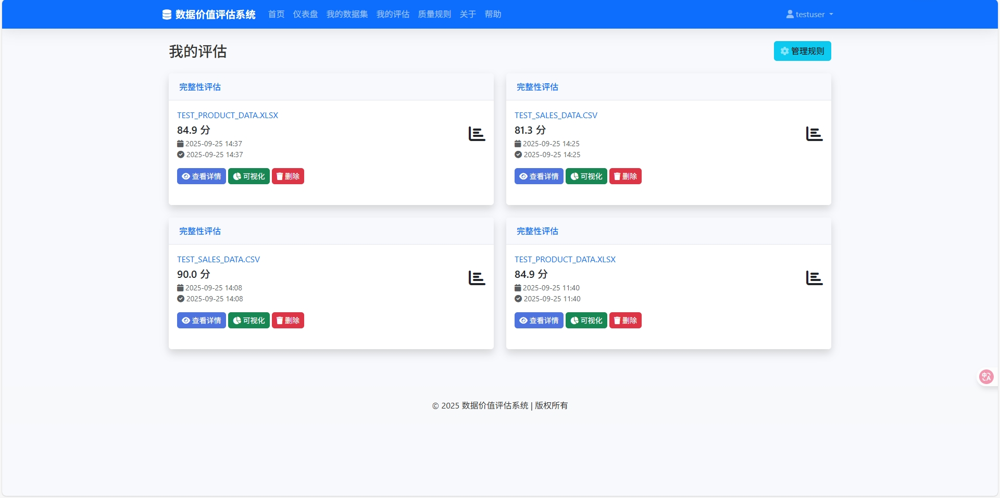
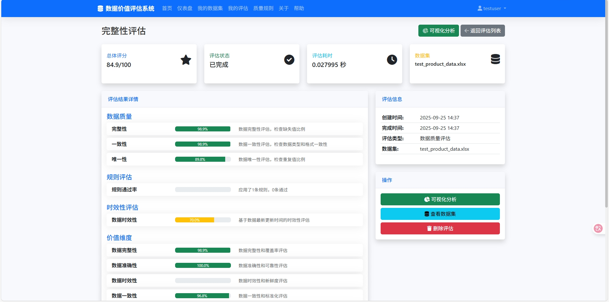
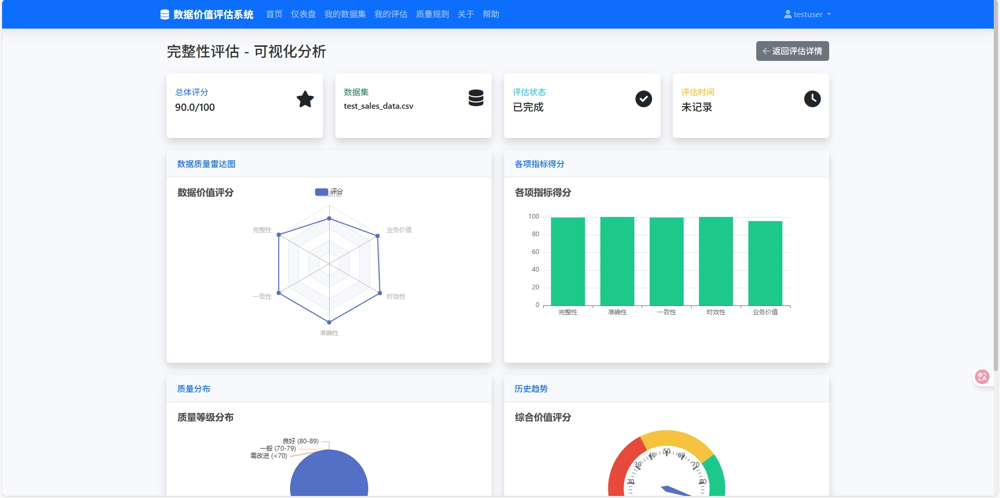

# 数据价值评估系统

一个基于Flask的数据质量与价值评估平台，用于评估数据集的质量、完整性和业务价值。

## 技术栈

- **后端框架**: Flask (Python)
- **前端框架**: Bootstrap 5 + jQuery
- **数据库**: SQLAlchemy (SQLite/MySQL/PostgreSQL)
- **数据可视化**: ECharts
- **模板引擎**: Jinja2
- **用户认证**: Flask-Login
- **开发环境**: Python 3.8+

## 主要功能

1. **数据集管理**
   - 上传、查看、编辑和删除数据集
   - 数据集预览与基本信息展示
   - 支持CSV、Excel、JSON等常见格式

2. **数据质量评估**
   - 完整性评估
   - 准确性评估
   - 一致性评估
   - 时效性评估

3. **业务价值评估**
   - 业务价值评分
   - 综合价值评分

4. **可视化分析**
   - 雷达图展示各项指标
   - 柱状图对比不同维度
   - 仪表盘展示综合评分

5. **规则管理**
   - 自定义数据质量规则
   - 规则组合与评估

## 项目图片展示





## 安装与配置

1. 克隆仓库:
```bash
git clone https://github.com/yourusername/data-value-assessment.git
cd data-value-assessment
```

2. 创建虚拟环境并安装依赖:
```bash
python -m venv venv
source venv/bin/activate  # Linux/Mac
venv\Scripts\activate  # Windows
pip install -r requirements.txt
```

3. 配置环境变量:
```bash
cp .env.example .env
# 编辑.env文件配置数据库等参数
```

4. 初始化数据库:
```bash
flask db init
flask db migrate
flask db upgrade
```

5. 运行开发服务器:
```bash
flask run
```

## 项目结构

```
data-value-assessment/
├── app.py                # 应用入口
├── config.py             # 配置文件
├── requirements.txt      # 依赖列表
├── migrations/           # 数据库迁移文件
├── models/               # 数据模型
│   ├── assessment.py     # 评估模型
│   └── dataset.py        # 数据集模型
├── routes/               # 路由/控制器
│   ├── assessment.py     # 评估相关路由
│   └── data.py           # 数据集相关路由
├── static/               # 静态文件
│   ├── css/              # CSS样式
│   └── js/               # JavaScript
├── templates/            # 模板文件
│   ├── assessment/       # 评估相关模板
│   └── data/             # 数据集相关模板
└── utils/                # 工具类
    ├── assessment_engine.py  # 评估引擎
    └── data_processor.py      # 数据处理工具
```

## 使用说明

1. **注册/登录**
   - 访问 `/register` 注册新账户
   - 访问 `/login` 登录系统

2. **数据集管理**
   - 访问 `/datasets` 查看数据集列表
   - 点击"上传数据集"按钮添加新数据集

3. **创建评估**
   - 在数据集详情页点击"新建评估"
   - 选择评估规则并提交

4. **查看结果**
   - 评估完成后，可在评估列表查看评分
   - 点击"可视化"按钮查看详细图表
   
   注：默认登录账号：admin   密码：admin123

## 贡献指南

1. Fork项目
2. 创建特性分支 (`git checkout -b feature/AmazingFeature`)
3. 提交更改 (`git commit -m 'Add some AmazingFeature'`)
4. 推送到分支 (`git push origin feature/AmazingFeature`)
5. 提交Pull Request

## 许可证

MIT License

Copyright (c) 2025 achen5055

## 联系方式

如有问题或建议，请联系: 505500019@qq.com